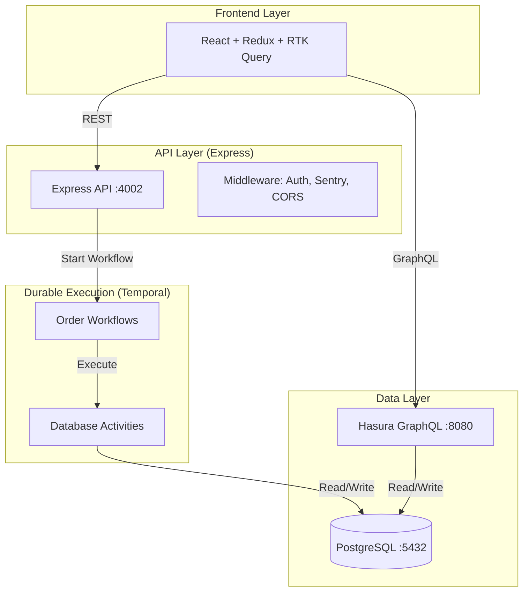
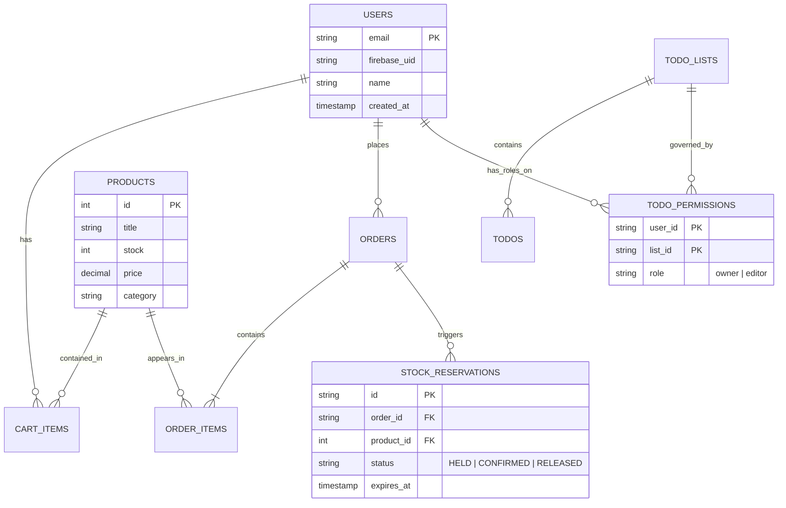

# Backend - Project-1 Architecture & Documentation

## Overview

**Backend Overview**
This project serves as the backbone for a robust e-commerce and task management ecosystem, prioritizing durability, atomicity, and scalability.

*   **Hybrid Authentication** — Firebase handles OAuth flows (Google, GitHub) and email verification client-side, while the Express backend verifies the Firebase ID token via Admin SDK and persists every user into PostgreSQL — giving full ownership of data without rebuilding login UI.
*   **Contract-First REST API** — All endpoints are designed around the exact response shape the frontend expects, ensuring a seamless transition from mock data to a real Postgres-backed API.
*   **Config-Driven Product Layer** — ~200 products seeded from DummyJSON into PostgreSQL, exposed via paginated REST endpoints with atomic inventory tracking.
*   **Server-Side Cart with IndexedDB Fallback** — Cart items are persisted in PostgreSQL per user for cross-device synchronization, with IndexedDB acting as a silent local fallback if the backend is unreachable.
*   **Durable Order Placement via Temporal** — Order placement runs as a Temporal workflow. It handles stock reservation, status updates, and cleanup atomically. If a server crashes mid-process, Temporal resumes exactly where it left off.
*   **Atomic Inventory Reservation** — Using PostgreSQL `SELECT ... FOR UPDATE` row-level locking, we prevent race conditions where multiple users try to buy the last item simultaneously. Stock is "held" during checkout and automatically released if not confirmed within 10 minutes.
*   **GraphQL via Hasura** — Hasura sits on top of PostgreSQL, auto-generating a full GraphQL API with Row-Level Security (RLS) ensuring users only see their own private data.
*   **Modular Monolith Architecture** — Clean separation between routes, activities, and workflows. Each module is self-contained and ready to be scaled independently.
*   **Dockerized Infrastructure** — The entire stack (Postgres, Hasura, Temporal, Express) is orchestrated via Docker Compose for production-parity development environments.

---

## Architecture



---

## Tech Stack

| Layer | Technology | Purpose |
| :--- | :--- | :--- |
| **Runtime** | Node.js (TS) | Primary execution environment |
| **Framework** | Express.js | REST API routing |
| **Database** | PostgreSQL | Relational data persistence |
| **Workflows** | Temporal.io | Durable order & inventory logic |
| **GraphQL** | Hasura | Instant GraphQL API over Postgres |
| **Auth** | Firebase Admin | Token verification & User management |
| **Tracking** | Sentry | Error monitoring & Performance |
| **Infrastructure**| Docker | Containerized services |

---

## ER Diagram (Core Tables)



---

## 🛠️ Key Logic & Scenarios

### 1. The "Race for the Last Item" (Product Scenario)
When two users attempt to purchase the same "last item" in stock:
1.  **Atomic Locking:** The backend initiates a transaction and executes `SELECT stock FROM products WHERE id = $1 FOR UPDATE`. This locks the row.
2.  **Sequential Processing:** The second request is blocked by the database until the first one commits or rolls back.
3.  **Conflict Handling:** The first user succeeds, stock drops to 0. The second request then resumes, sees 0 stock, and the API returns a `409 Conflict` error.
4.  **Grace Period:** A `stock_reservation` is created with a `HELD` status for 10 minutes. If the user doesn't complete the checkout (via Temporal workflow completion), the stock is automatically returned to the pool.

### 2. Secure Task Management (Permissions Scenario)
Access to Todo Lists is governed by a **Role-Based Access Control (RBAC)** system:
*   **Owner:** Can view, edit, delete the list, and share it with others.
*   **Editor:** Associated with a list via `todo_permissions`. They can add or delete individual tasks but cannot delete the entire list.
*   **Verification:** Every request to `/api/todo-lists/:id/...` checks the `X-User-Email` header against the `owner_id` or the `todo_permissions` table.

### 3. Graceful Address Changes
The Temporal workflow can be extended to include a "grace period" signal. Before the order status moves to "Shipped", the workflow can wait for a `change-address` signal. If received within the grace window, the invoice and shipping labels are re-generated automatically.

### 4. Admin Powers & System Oversight 👑
The system provides multi-layered administrative control:
*   **Hasura Console (:8080):** Admins can directly manage data, adjust stock levels, or update order statuses via a web UI.
*   **Temporal Web UI (:8233):** Provides real-time visibility into every order workflow. Admins can manually "Signal" a workflow (e.g., forcing a payment confirmation) or "Reset" a failed workflow to a previous step.
*   **Sentry Logging:** All backend errors and performance bottlenecks are captured and reported automatically for administrative review.

### 5. Email & Notifications 📧
*   **Current State:** To simplify development and avoid dependencies on external API keys, all notifications (Order Confirmation, Invoices) are **simulated**.
*   **Observability:** Instead of sending a real mail to a Gmail account, the system logs the full email payload (including recipient email and HTML body) to the backend logs.
*   **Production Path:** The architecture is ready for a real provider (like SendGrid or AWS SES). You would simply update the `order-notification` activity in `order-activities.ts` to call the external mail API.

---

## Project Structure

```text
project-1/
├── frontend/             # React + Vite application
│   ├── src/              # Components, Redux slices, Pages
│   └── package.json
├── backend/              # Node.js + Express application
│   ├── src/
│   │   ├── activities/   # Temporal Activity implementations
│   │   ├── workflows/    # Temporal Workflow logic
│   │   ├── lambdas/      # Independent background logic
│   │   └── index.ts      # Express API server
│   ├── doc.md            # This documentation
│   └── package.json
├── docker-compose.yml    # Full stack orchestration
└── README.md             # Project-wide overview
```

---

## Open Ends & Future Roadmap
This is currently a skeleton implementation designed for learning and iteration. Future enhancements include:
*   **Real Email Integration:** Moving from console logs to SendGrid/SES.
*   **Payment Gateways:** Integration of Stripe/Razorpay webhooks into Temporal.
*   **Advanced RLS:** Fine-grained Hasura permissions for sharing specific tasks.
*   **Refund Workflows:** Automating the inventory return if a user requests a refund after confirmation.

---

## Getting Started
1. Start infrastructure: `docker start backend-postgres-1 backend-temporal-1`
2. Install dependencies: `npm install`
3. Run seeder: `npm run seed`
4. Start Server: `npm start`
5. Start Worker: `npm run worker`
