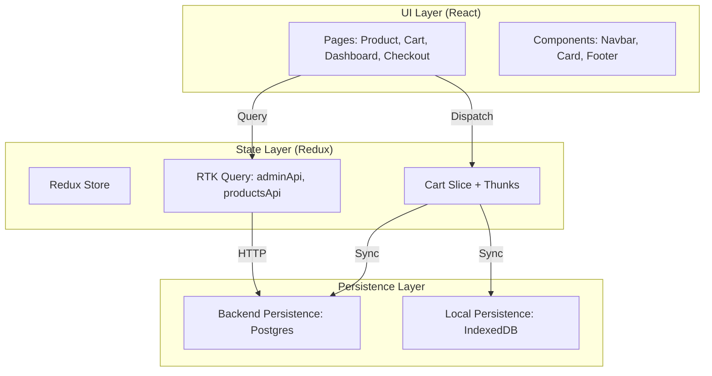

# Frontend - Project-1 Architecture & Documentation

## Overview

**Frontend Overview**
A modern, reactive e-commerce and task management dashboard built with React and TypeScript. The UI is designed to be "config-driven" and "backend-resilient," ensuring a smooth user experience regardless of network state or device type.

*   **Reactive State Management** — Powered by Redux Toolkit and RTK Query. UI updates for cart additions or todo changes happen instantly via optimistic updates, while data fetching is cached and synchronized automatically.
*   **Hybrid Cart Persistence** — Implements a "Backend-First, IndexedDB Fallback" strategy. Logged-in users' carts are preserved in PostgreSQL, while guests or offline users benefit from local IndexedDB storage.
*   **Dynamic Design System** — A dark-themed, glassmorphic UI using Vanilla CSS and React Context. Features a global theme switcher and sleek micro-animations for a premium feel.
*   **Advanced Clean IDs** — All system entities (Orders, Tasks, Lists) use a highly readable, sequential, and descriptive ID naming convention (e.g., `order-1-24022026`), improving accessibility in the dashboard and Hasura.
*   **Firebase Authentication** — Seamless integration with Firebase for Google, GitHub, and Email/Password flows.
*   **Atomic Stock UI** — Real-time stock feedback. If a product is out of stock, purchasing is disabled. During checkout, if stock is lost, conflict banners allow for quick cart refreshing.
*   **Protected Dashboard** — A secure area for managing Todo lists and Order history, accessible only after successful authentication.

---

## Architecture



---

## Tech Stack

| Layer | Technology | Purpose |
| :--- | :--- | :--- |
| **Framework** | React 18 + Vite | Modern, fast build tool and UI library |
| **Language** | TypeScript | Type safety and improved developer DX |
| **State** | Redux Toolkit | Centralized application state |
| **Fetching** | RTK Query | Automated caching and API synchronization |
| **Auth** | Firebase SDK | Client-side OAuth and token management |
| **Storage** | IndexedDB / localForage | Offline-first persistence |
| **Styling** | Vanilla CSS (CSS Variables) | Flexible, high-performance styling |
| **Icons** | Lucide React | Modern icon set |

---

##  Project Structure

```text
frontend/
├── src/
│   ├── app/              # Store configuration
│   ├── components/       # Reusable UI elements (Navbar, Button)
│   ├── contexts/         # ThemeContext, AuthContext
│   ├── features/         # Logic-heavy slices (adminApi, productsApi, Cart)
│   ├── pages/            # Top-level route components (Dashboard, ProductPage)
│   ├── utils/            # Helpers (Validation, Date formatting)
│   └── main.tsx          # App entry point
├── public/               # static assets
├── index.html            # SPA container
├── vite.config.ts        # Bundler configuration
└── package.json          # Dependencies
```

---

##  Key Features & Logic

### 1. The Persistence Strategy 
The frontend ensures your data is never lost:
*   **Cart Hydration:** On app startup, a `hydrateCart` thunk is dispatched. It checks the backend first. If the backend is unreachable (offline or server down), it silently loads the latest state from **IndexedDB**.
*   **Fire-and-Forget Sync:** Every cart action (Add, Update, Remove) updates the Redux store *immediately* and then attempts a background sync to the backend API.

### 2. High-Fidelity Theming 
The app uses a curated dark palette (Rich Blacks and Vibrant Primary colors) managed via CSS Variables.
*   **Reactive Switching:** Changing the theme in settings updates the values on `:root`, instantly transforming the entire app without a reload.
*   **Glassmorphism:** Cards and Modals use backdrop-blur and semi-transparent borders to create a layered, premium feel.

### 3. Integrated Checkout
*   **Sequential IDs**: The frontend uses backend-generated Sequential IDs (e.g., `order-5-25022026`), ensuring every order has a clean, human-readable identifier.
*   **Concurrency Feedback**: The checkout page listens for `409 Conflict` errors. If an item sells out, the UI highlights the specific items, allowing for a seamless recovery without losing the entire order.

---

##  Getting Started

1.  **Install dependencies:**
    ```bash
    npm install
    ```
2.  **Environment Setup:**
    Ensure the backend is running at `http://localhost:4002`.
3.  **Run Development Server:**
    ```bash
    npm run dev
    ```
4.  **Production Build:**
    ```bash
    npm run build
    ```

---

*   **Advanced Filtering:** Multi-select category filters and price range sliders.
*   **Real-time Notifications:** Web-socket or polling support to show order status updates (e.g., "Paid", "Shipped") instantly.
